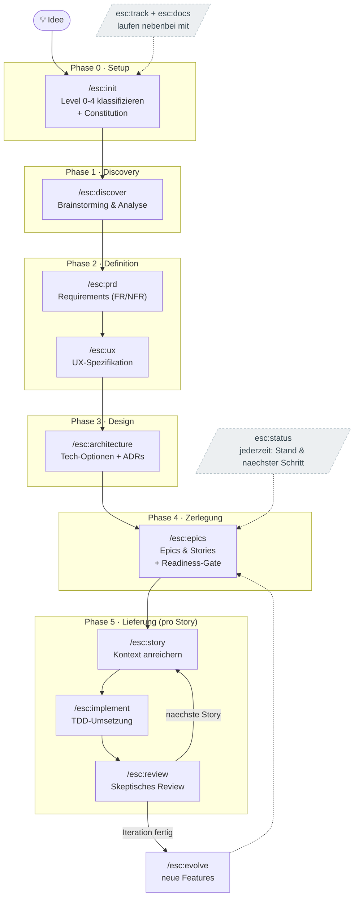

# ESC — Erik's Spec Crafting

> Ein scale-adaptiver, interaktiver **Spec-Driven-Development**-Workflow als Claude-Code-Plugin — auf Deutsch.
> ESC erarbeitet mit dir **Abschnitt für Abschnitt, kritisch hinterfragend** die Spezifikationen deines
> Produkts — von der **Idee** über Analyse, PRD, UX, Architektur und Stories bis zur **KI-gestützten
> Implementierung**. Die Specs sind dabei **Guardrails**, die der KI klare Regeln und Grenzen setzen —
> gegen Halluzination, Scope-Creep und Kontextverlust.

**Version 1.3.0** · Namespace `esc:` · 16 Skills · kritische Sichtweisen · Plugin für [Claude Code](https://claude.com/claude-code)

---

## Inhalt

1. [Was ist ESC?](#was-ist-esc)
2. [Was ESC ausmacht](#was-esc-ausmacht)
3. [Kernkonzepte](#kernkonzepte)
4. [Der komplette Workflow](#der-komplette-workflow)
5. [Beispiel-Durchlauf](#beispiel-durchlauf)
6. [Der `esc/`-Workspace](#der-esc-workspace)
7. [Installation & Einrichtung](#installation--einrichtung)
8. [Schnellstart (TL;DR)](#schnellstart-tldr)
9. [Tipps & Best Practices](#tipps--best-practices)
10. [FAQ](#faq)
11. [Projektstruktur](#projektstruktur)
12. [Lizenz](#lizenz)

---

## Was ist ESC?

ESC ist eine Sammlung von **16 zusammenarbeitenden Claude-Code-Skills**, die einen vollständigen
Produktentwicklungs-Prozess abbilden. Der Grundgedanke: **Erst die Spezifikation, dann der Code.**

Statt einer KI vage Prompts zuzuwerfen und zu hoffen, erarbeitet ESC mit dir **Abschnitt für Abschnitt**
präzise, testbare Spezifikationen — und betrachtet sie dabei aus wechselnden **kritischen Sichtweisen**.
Diese Specs werden zur **Single Source of Truth** und zu **Leitplanken (Guardrails)**, an die sich die KI
bei der Umsetzung halten *muss*. Das Ergebnis: weniger Raten, weniger Halluzination, ein nachvollziehbarer
roter Faden von der Idee bis zum Code — und du behältst die Kontrolle über jeden Abschnitt.

**ESC ist für dich, wenn du:**
- ein Softwareprodukt oder Feature strukturiert und durchdacht aufbauen willst,
- die KI-Entwicklung an klaren Regeln und Akzeptanzkriterien ausrichten möchtest,
- gern interaktiv im Terminal geführt wirst — mit Auswahl-Fragen und kritischem Hinterfragen,
- die volle Doku (Specs, FR/NFR, ADRs, Diagramme) gebündelt und mitlaufend haben willst.

### Die Leitprinzipien

1. **Spec vor Code** — jede Phase erzeugt ein Artefakt, das die nächste speist. Code ist die letzte Aktivität.
2. **Specs als Guardrails** — Non-Goals, Constitution und testbare Akzeptanzkriterien lassen keinen Raum für Halluzination oder Scope-Creep.
3. **WAS vor WIE** — Problem und Anforderungen werden *ohne* Technologie beschrieben; der Stack fällt bewusst erst in der Architektur-Phase.
4. **Testbar oder es zählt nicht** — Anforderungen in fester, testbarer [Satzsyntax](shared/requirements-syntax.md).
5. **Begründungen festhalten** — jede wichtige Entscheidung mit Trade-offs und verworfenen Alternativen im Decision-Log.
6. **Kritisch hinterfragen ist Pflicht** — an definierten Gates greift die skeptische Sichtweise an, nicht optional.
7. **Der Nutzer behält die Kontrolle** — Specs werden Abschnitt für Abschnitt gemeinsam erarbeitet; nichts wird ohne Zustimmung festgeschrieben.
8. **Single Source of Truth auf der Platte** — der Zustand lebt im `esc/`-Ordner, nicht im flüchtigen Chatverlauf. Pausier-, fortsetz- und übergebbar.

---

## Was ESC ausmacht

- 🧩 **Abschnitt-für-Abschnitt-Co-Authoring.** Specs werden nicht in einem Rutsch generiert, sondern
  gemeinsam erarbeitet: *Entwurf → kritisch hinterfragen → du entscheidest → nächster Abschnitt.*
- 🔍 **Kritische Sichtweisen statt Ja-Sager.** Jede Phase betrachtet das Artefakt aus einer Linse
  (analytisch, Fokus, Nutzer, Architektur, Planung, pragmatisch); an den Gates greift die **skeptische
  Sicht** mit konkreten Einwänden an.
- 🧭 **Inspiration aus echten Produkten.** In Analyse und bei neuen Features fließen bestehende
  (kommerzielle) Produkte ein — du bringst ein, was dir gefällt und warum, *und* die KI schlägt aktiv
  Produkte samt konkreter Übernahmen und Begründung vor. Immer kritisch: Bedarf statt Oberfläche, mit
  bewussten Verzichten.
- 🎚️ **Schärfe skaliert mit dem Level.** Kleinkram (Level 0/1) bleibt schnell, große Vorhaben (Level 3/4)
  werden kompromisslos geprüft — inkl. Annahmen-Audit und skeptischem Zweit-Pass.
- 🛡️ **Specs als Guardrails.** Constitution (nicht-verhandelbare Regeln), explizite Non-Goals und
  testbare Akzeptanzkriterien geben der KI klare Grenzen.
- 📚 **Gebündelte, mitlaufende Doku.** Die gesamte Produkt-Doku (Specs, FR/NFR getrennt, ADRs, Diagramme)
  lebt in `esc/docs/` und wird nebenbei mit Mermaid-Diagrammen aktuell gehalten.
- 🔁 **Weiterentwicklung eingebaut.** `esc:evolve` erarbeitet nach einem fertigen Stand kritisch neue
  Features und speist sie als Epics/Stories zurück in die Pipeline.
- 🇩🇪 **Durchgängig deutsch** und auf Terminal-Bedienung per Auswahl (Pfeil + Leertaste) ausgelegt.

---

## Kernkonzepte

### 1. Scale-adaptive Levels (0–4)

Nicht jedes Vorhaben braucht ein PRD oder eine Architektur. `esc:init` stuft dein Vorhaben einmalig ein
und blendet danach nur die nötigen Phasen ein.

| Level | Name | Umfang | Was durchlaufen wird |
|------|------|--------|----------------------|
| **0** | Atomarer Change | 1 Story, < 1 Tag (Bugfix, Config) | Quick-Spec → Umsetzung |
| **1** | Kleines Feature | 1–10 Stories, kein Architektur-Risiko | Quick-Spec → Stories → Umsetzung |
| **2** | Mittleres Feature | 5–15 Stories, etwas Architektur | (Discovery) → PRD → leichte ADRs → Stories |
| **3** | Komplexes System | 12–40 Stories, mehrere Subsysteme | Volle Pipeline |
| **4** | Enterprise / Produkt | 40+ Stories, mehrere Teams/Produkte | Volle Pipeline + UX-Pflicht |

Details: [`shared/levels.md`](shared/levels.md).

### 2. Die Constitution (Guardrails)

Beim Start erarbeitet ESC eine `esc/docs/constitution.md`: **nicht-verhandelbare Regeln**, an die sich
jede spätere KI-Implementierung halten muss — Stack-Zwänge, Coding-Standards, Test-Anspruch,
Security/Compliance-Grenzen, Architektur-Leitplanken, Out-of-Scope-Grundsätze. Jede Regel ist prüfbar
formuliert (eine Zeile, im Zweifel als „MUSS"-Satz).

### 3. Testbare Anforderungssyntax

Anforderungen und Akzeptanzkriterien folgen festen Satzmustern, damit sie eindeutig und testbar sind:

| Muster | Schablone | Beispiel |
|---|---|---|
| Ereignis | **WENN** `<Auslöser>`, **MUSS** das System `<Reaktion>`. | WENN ein Nutzer auf „Speichern" klickt, MUSS das System die Eingaben validieren. |
| Zustand | **SOLANGE** `<Zustand>`, **MUSS** das System `<Reaktion>`. | SOLANGE kein Nutzer angemeldet ist, MUSS das System nur die Login-Seite zeigen. |
| Unerwünscht | **FALLS** `<Bedingung>`, **DANN MUSS** das System `<Reaktion>`. | FALLS die Zahlung fehlschlägt, DANN MUSS das System den Warenkorb erhalten. |
| Optional | **WO** `<Feature>`, **MUSS** das System `<Reaktion>`. | WO 2FA aktiv ist, MUSS das System nach dem Passwort einen Code abfragen. |

Vollständig: [`shared/requirements-syntax.md`](shared/requirements-syntax.md).

### 4. Co-Authoring (Abschnitt für Abschnitt)

Specs werden **nicht** in einem Rutsch generiert. Für jeden Abschnitt: ESC legt einen Entwurf vor, greift
ihn kritisch an, **du** bestätigst/änderst/verwirfst — erst dann der nächste Abschnitt. Nichts wird ohne
deine Zustimmung festgeschrieben. Tiefe skaliert mit dem Level. Protokoll: [`shared/coauthoring.md`](shared/coauthoring.md).

### 5. Elicitation per Auswahl

Entscheidungen triffst du per native Auswahl (Pfeil + Leertaste), nicht durch Tippen; freie Eingabe ist
immer möglich, und ESC **wartet** auf deine Antwort. Lange Optionslisten werden in 4er-Häppchen
angeboten. Protokoll & Vertiefungs-Methoden: [`shared/elicitation.md`](shared/elicitation.md).

### 6. Kritische Sichtweisen

Jede Phase wird aus einer **kritischen Sichtweise** geführt — einer Linse, die das Artefakt konkret
angreift und schärft (kein Deko-Theater):

| Sichtweise | Phase | Leitfrage |
|---|---|---|
| **Analytisch** | `discover` | „Woher *wissen* wir das? Wo sind die Daten?" |
| **Fokus** | `prd` | „Was bauen wir bewusst **nicht**? Woran messen wir Erfolg?" |
| **Nutzer** | `ux` | „Wie fühlt sich der schlechteste Moment an?" |
| **Architektur** | `architecture` | „Welche Annahme trägt das? Was bereuen wir in 2 Jahren?" |
| **Planung** | `epics`/`story` | „Ist das wirklich vertikal und unabhängig?" |
| **Pragmatisch** | `implement` | „Läuft es? Beweise es mit grünen Tests." |
| **🔪 Skeptisch** | `review` + **alle Gates** | „Und *warum* glaubst du das? Was, wenn das Gegenteil stimmt?" |
| **Prinzipien** | `init`/`status` | „Bleibt das innerhalb unserer Regeln?" |

Direkt abrufbar: `esc:consult` (eine Sichtweise), `esc:council` (mehrere debattieren),
`esc:challenge` (skeptischer Zweit-Pass). Details: [`shared/viewpoints.md`](shared/viewpoints.md).

### 7. Intensitäts-Regler (Schärfe nach Level)

Wie hart kritisch nachgefragt wird, **skaliert mit dem Level** — schnell beim Kleinen, kompromisslos beim Großen:

| Level | Sichtweisen | Skeptische Sicht | Annahmen-Audit | Skeptischer Zweit-Pass | Perspektiven-Runde |
|------|-------------|------------------|----------------|------------------------|--------------------|
| **0** | leise | 1 Einwand am Akzeptanz-Gate | – | – | – |
| **1** | pro Phase | alle Gates (2–3 Einwände) | bei Requirements | – | – |
| **2** | voll | alle Gates, hartnäckig | alle Gates | PRD + Architektur | auf Wunsch |
| **3** | voll | maximal | alle Gates | alle großen Artefakte | auf Wunsch |
| **4** | voll + Runde | maximal | alle Gates | alle Artefakte | automatisch an Schlüssel-Gates |

Details: [`shared/intensity.md`](shared/intensity.md).

### 8. State & mitlaufende Doku

Der Prozess-Zustand liegt in `esc/state.yaml` (Level, Phase, Gate-Status, Decision-Log, Story-Liste) —
die Single Source of Truth, jederzeit pausier- und fortsetzbar. Zwei Dateien laufen **nebenbei** mit:

- **`esc/TRACKER.md`** — Pipeline-Fortschritt als Mermaid-Flowchart, Artefakt-/Gate-Status, Story-Board,
  Decision-Log. Deterministisch aus `state.yaml` gerendert (`scripts/render_tracker.py`, stdlib-only
  Fallback) oder vom Skill selbst.
- **`esc/docs/DOCUMENTATION.md`** — lebende Doku mit Mermaid: Systemkontext, Architektur/Komponenten,
  Datenmodell (`erDiagram`), Kern-Flows (`sequenceDiagram`), Glossar.

Schema & Konventionen: [`shared/state.md`](shared/state.md) · [`shared/tracking.md`](shared/tracking.md).

---

## Der komplette Workflow



### Die 16 Skills im Detail

#### Phase 0 — Setup

**`/esc:init "<idee>"`** — Vorhaben starten & klassifizieren
- **Zweck:** Idee erfassen, scale-adaptiv einstufen (Level 0–4), Workspace anlegen, **Constitution** erarbeiten.
- **Interaktion:** Kurze Konversation zu Was/Problem/Greenfield-vs-Brownfield/Größe; bei Brownfield wird die Codebase gescannt.
- **Erzeugt:** `esc/state.yaml`, `esc/docs/constitution.md`, initiale `esc/TRACKER.md` + `esc/docs/DOCUMENTATION.md`.

#### Phase 1 — Discovery

**`/esc:discover`** — Brainstorming & Analyse → Product Brief
- **Zweck:** Problemfeld durchdringen (WAS/WARUM, keine Technologie), aus analytischer Sicht.
- **Themen:** Problem, Zielgruppe & Jobs-to-be-Done, Alternativen, **Inspiration & Wettbewerb** (was du an anderen Produkten magst + eigene KI-Vorschläge, kritisch), Vision, Ziele, Scope (inkl. **Non-Goals**), Risiken & Annahmen.
- **Erzeugt:** `esc/docs/product-brief.md`.

#### Phase 2 — Definition

**`/esc:prd`** — Requirements definieren
- **Zweck:** testbare Anforderungen als Guardrails, aus Fokus-Sicht. Bei Level 0/1 stattdessen eine schlanke **Quick-Spec**.
- **Gates (Pflicht):** messbare Erfolgsmetriken · funktionale Requirements inkl. **Edge-Case-Jagd**.
- **Erzeugt:** `esc/docs/prd.md` (Überblick) + getrennt `esc/docs/requirements/functional.md` (FR) und `non-functional.md` (NFR).

**`/esc:ux`** — UX-Spezifikation (nur bei UI)
- **Zweck:** Verhalten der Oberfläche festlegen, aus Nutzer-Sicht — Screen-Inventar, Flows, Zustände (Leer/Lädt/Erfolg/Fehler/Keine-Rechte), Verhaltensregeln, Barrierefreiheit.
- **Erzeugt:** `esc/docs/ux-spec.md`.

#### Phase 3 — Design

**`/esc:architecture`** — Solution Design & ADRs
- **Zweck:** das WIE festlegen, aus Architektur-Sicht — Stack, Struktur, Datenmodell, Schnittstellen.
- **Gate (Pflicht):** je nicht-trivialer Entscheidung 2–3 Optionen mit Pro/Contra/Risiko, Empfehlung, Vertiefung, dann **ADR** mit verworfenen Alternativen.
- **Erzeugt:** `esc/docs/architecture/architecture.md` und `esc/docs/architecture/decisions/ADR-*.md`.

#### Phase 4 — Zerlegung

**`/esc:epics`** — Epics & Stories + Readiness-Gate
- **Zweck:** Anforderungen in vertikal geschnittene, unabhängig testbare Stories zerlegen, aus Planungs-Sicht.
- **Readiness-Gate:** prüft, ob PRD/UX/Architektur reif sind, bevor Stories entstehen.
- **Gate (Pflicht):** jede Story hat **testbare Akzeptanzkriterien** mit Requirement-Rückverweis.
- **Erzeugt:** `esc/docs/epics.md` + Story-Einträge in `state.yaml`.

#### Phase 5 — Lieferung (iterativ pro Story)

**`/esc:story <id>`** — Self-contained Story-Kontext
- **Zweck:** eine Story so anreichern, dass ein frischer Agent sie **ohne weitere Recherche** umsetzen kann (Requirements, ADRs, Constitution-Regeln, echte Dateipfade, Testplan, Out-of-Scope, offene Fragen).
- **Erzeugt:** `esc/docs/stories/<id>-<slug>.md`.

**`/esc:implement <id>`** — Testgetriebene Umsetzung
- **Zweck:** Story **strikt nach Spec** bauen, aus pragmatischer Sicht — red-green-refactor, im Rahmen der Constitution, kein Scope-Creep.
- **Verifikation:** Tests/Build/Linter werden tatsächlich ausgeführt; kein „fertig" ohne Beleg.

**`/esc:review <id>`** — Skeptisches Review
- **Zweck:** kritisch gegen die Spec prüfen (skeptische Sicht). Jedes Akzeptanzkriterium verifizieren; Korrektheit, Edge-Cases, Constitution-Konformität, Sicherheit, Spec-Drift, Wartbarkeit.

#### Weiterentwicklung

**`/esc:evolve`** — Neue Features erarbeiten
- **Zweck:** nach einem fertigen Stand kritisch neue Features entwickeln (aus Code + Doku), priorisieren und als neue Epics/Stories in die Pipeline einspeisen.

#### Querschnitt (jederzeit)

**`/esc:status`** — Stand & nächster Schritt (reiner Lese-Skill).
**`/esc:track`** — `esc/TRACKER.md` regenerieren. **`/esc:docs`** — `esc/docs/DOCUMENTATION.md` pflegen. (Beide laufen nebenbei mit.)

#### Sichtweisen auf Abruf

**`/esc:consult [sichtweise] [frage]`** — eine kritische Sichtweise gezielt auf eine Frage anlegen.
**`/esc:council [frage]`** — mehrere Sichtweisen debattieren eine Entscheidung und liefern eine Synthese.
**`/esc:challenge [artefakt]`** — skeptischer Zweit-Pass: ein frischer Subagent liest ein Artefakt ohne Bias gegen und meldet konkrete Befunde.

---

## Beispiel-Durchlauf

```text
# In deinem Produkt-Projekt (nicht im ESC-Repo):
/esc:init "Eine App, mit der Vereine Mitgliedsbeiträge verwalten und Mahnungen verschicken"
   → ESC fragt nach Problem, Zielgruppe, Greenfield/Brownfield, Größe
   → schlägt Level 3 vor, erarbeitet die Constitution
   → legt esc/state.yaml, esc/docs/constitution.md, esc/TRACKER.md, esc/docs/DOCUMENTATION.md an

/esc:discover      → Product Brief — Abschnitt für Abschnitt, kritisch hinterfragt
/esc:prd           → Ziele/Metriken + FR & NFR getrennt (functional.md / non-functional.md)
/esc:ux            → Screen-Inventar, Flows, Zustände
/esc:architecture  → 3 ADRs (DB, Auth, Mailversand) mit Pro/Contra
/esc:epics         → Readiness-Gate ✓, Epics + Stories mit Akzeptanzkriterien

/esc:story 1.1     → angereicherte Story-Datei
/esc:implement 1.1 → TDD-Umsetzung, Tests grün
/esc:review 1.1    → skeptisches Review, Story auf „done"
/esc:status        → „Als Nächstes: /esc:story 1.2"
...
/esc:evolve        → wenn die Iteration steht: neue Features → neue Epics/Stories
```

Während des gesamten Laufs zeigen `esc/TRACKER.md` (Fortschritt) und `esc/docs/DOCUMENTATION.md`
(Architektur, Datenmodell, Flows) jederzeit den aktuellen Stand — direkt als gerenderte Diagramme.

---

## Der `esc/`-Workspace

ESC trennt **Prozess-State** (direkt in `esc/`) von der **Produkt-Doku** (gebündelt in `esc/docs/`).
Der Ordner ist bewusst kein Dot-Ordner, damit IDE/LLM ihn indexieren:

```text
esc/
├── state.yaml                # Prozess-State + Decision-Log — Single Source of Truth
├── TRACKER.md                # Mitlaufender Fortschritts-Tracker (Mermaid)
└── docs/                     # die gesamte Produkt-Dokumentation (das Deliverable)
    ├── DOCUMENTATION.md      # lebende Doku-Übersicht (Mermaid: Kontext, Architektur, ER, Flows)
    ├── constitution.md       # Nicht-verhandelbare Guardrails für die KI
    ├── product-brief.md      # aus /esc:discover
    ├── prd.md                # aus /esc:prd  (oder quick-spec.md bei Level 0/1)
    ├── requirements/
    │   ├── functional.md     # FR — funktionale Anforderungen (testbar)
    │   └── non-functional.md # NFR — nicht-funktionale Anforderungen
    ├── ux-spec.md            # aus /esc:ux
    ├── architecture/
    │   ├── architecture.md   # aus /esc:architecture
    │   └── decisions/        # ADRs
    │       └── ADR-0001-*.md
    ├── epics.md              # aus /esc:epics
    └── stories/
        └── 1.1-*.md
```

---

## Installation & Einrichtung

ESC ist ein **Claude-Code-Plugin**. Es funktioniert überall, wo Claude Code läuft: im **Terminal-CLI**,
in den **IDE-Erweiterungen** (VS Code / JetBrains) und in der **Claude-Desktop-App** (die Claude Code
integriert).

### Voraussetzungen
- [Claude Code](https://claude.com/claude-code) installiert und eingeloggt.
- `git` vorhanden. (Optional `python3` für das deterministische Tracker-Rendering — sonst rendert der Skill selbst.)

### Variante A — Aus GitHub installieren (empfohlen)

In jeder Claude-Code-Sitzung (Terminal, IDE oder Desktop):

```text
/plugin marketplace add ES-92/esc
/plugin install esc@esc
```

Bestätige die Installations-Dialoge. Danach stehen die Befehle `/esc:init`, `/esc:discover` … bereit.

> `ES-92/esc` ist die Kurzform für `https://github.com/ES-92/esc`. Du kannst auch die volle URL angeben.

### Variante B — Aus lokalem Klon installieren (zum Entwickeln/Anpassen)

```bash
git clone https://github.com/ES-92/esc.git
```
```text
/plugin marketplace add /pfad/zu/esc
/plugin install esc@esc-local
```

(Das Repo enthält ein lokales Marketplace `esc-local` in `.claude-plugin/marketplace.json`.)

### Variante C — Manuell ohne Plugin (schnell ausprobieren)

Kopiere den Inhalt von `skills/` nach `~/.claude/skills/`:

```bash
cp -R skills/* ~/.claude/skills/
```

Dann heißen die Befehle **ohne** Namespace: `/init`, `/discover`, … (Kollisionsrisiko mit anderen
Skills; deshalb ist der Plugin-Weg sauberer). Die `shared/`-Referenzen werden in diesem Fall über
`${CLAUDE_PLUGIN_ROOT}` nicht aufgelöst — nutze dann besser Variante A/B.

### Claude Desktop / IDE-Erweiterungen

Die Claude-Desktop-App und die IDE-Erweiterungen nutzen dieselbe Claude-Code-Engine. Öffne dort den
Plugin-/Befehls-Dialog und führe dieselben `/plugin`-Befehle wie unter Variante A aus.

### Verifizieren

```text
/esc:status        # sollte „kein Workspace gefunden, starte mit /esc:init" melden
/esc:init "Test"   # startet den geführten Ablauf
```

### Updaten

```text
/plugin marketplace update esc
/plugin update esc
```

---

## Schnellstart (TL;DR)

```text
1. /plugin marketplace add ES-92/esc
2. /plugin install esc@esc
3. cd <dein-produkt-projekt>
4. /esc:init "deine Produktidee in einem Satz"
5. Folge der Führung — bei Unklarheit jederzeit /esc:status
```

---

## Tipps & Best Practices

- **Starte im Produkt-Projekt, nicht im ESC-Repo.** Der `esc/`-Ordner gehört zu dem, was du baust.
- **Vertraue dem Level.** Bei kleinem Kram wählt `init` Level 0/1 und führt dich über eine Quick-Spec
  direkt zur Umsetzung — du kannst tiefere Phasen jederzeit per Opt-in erzwingen.
- **Nimm die Gates ernst.** Dort, wo die skeptische Sicht angreift, entstehen die meisten Spec-Fehler.
- **Committe `esc/docs/` mit.** Specs, ADRs, TRACKER und DOCUMENTATION sind reviewbare, gerenderte
  Artefakte — ideal für Pull Requests und Übergaben.
- **Pausieren ist gefahrlos.** Da der State auf der Platte liegt, steigst du mit `/esc:status` wieder ein.
- **Eine Story nach der anderen.** `story → implement → review` pro Story; das hält den Kontext klein.

---

## FAQ

**Muss ich alle Phasen durchlaufen?** Nein — das Level steuert, welche Phasen aktiv sind. ESC
überspringt nichts still, sondern weist auf ausgelassene Phasen hin und lässt dich opt-in nachziehen.

**Wie behalte ich die Kontrolle über die Specs?** Jeder Abschnitt wird einzeln vorgeschlagen, kritisch
hinterfragt und erst nach deiner Zustimmung festgeschrieben (Co-Authoring).

**Funktioniert es ohne Python?** Ja. `scripts/render_tracker.py` ist nur ein deterministischer Helfer
mit stdlib-only Fallback; fehlt Python, rendert der `track`-Skill den Tracker selbst.

**In welcher Sprache sind die Artefakte?** Deutsch — Interaktion und alle erzeugten Dokumente.

**Kann ich es anpassen?** Klar. Klone das Repo (Variante B), ändere Skills/Referenzen und installiere lokal.

---

## Projektstruktur

```text
.
├── .claude-plugin/
│   ├── plugin.json          # Plugin-Manifest (name: esc, v1.2.0)
│   └── marketplace.json     # Lokales Marketplace (esc-local) zum Testen/Entwickeln
├── skills/                  # Die 16 Skills (je SKILL.md)
│   ├── init/  discover/  prd/  ux/  architecture/  epics/
│   ├── story/  implement/  review/  evolve/
│   ├── status/  track/  docs/
│   └── consult/  council/  challenge/        # Sichtweisen auf Abruf
├── scripts/
│   └── render_tracker.py    # Deterministisches TRACKER.md-Rendering (stdlib-only Fallback)
├── shared/                  # Geteilte Referenzen, die alle Skills laden
│   ├── principles.md        # Leitprinzipien
│   ├── levels.md            # Scale-adaptive Level 0–4
│   ├── requirements-syntax.md # Testbare Anforderungssyntax
│   ├── elicitation.md       # Frage-Protokoll (Auswahl-first) + Vertiefungs-Methoden
│   ├── coauthoring.md       # Abschnitt-für-Abschnitt-Protokoll
│   ├── inspiration.md       # Inspiration & Wettbewerb (kritisch, beidseitig)
│   ├── viewpoints.md        # Die kritischen Sichtweisen
│   ├── intensity.md         # Intensitäts-Regler (Schärfe nach Level)
│   ├── state.md             # state.yaml-Schema + Workspace-Konventionen
│   ├── tracking.md          # Tracker- & Doku-Format (Mermaid-Vorlagen)
│   └── templates/           # ADR-Template u. a.
└── README.md
```

---

## Lizenz

MIT © Erik Schröder
