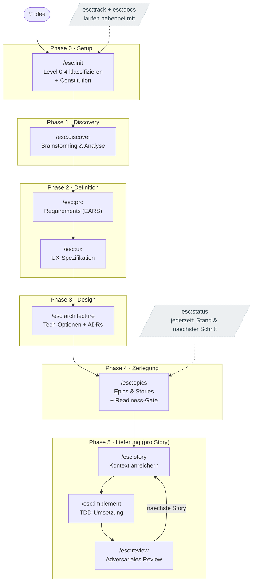

# ESC — Erik's Spec Crafting

> Ein scale-adaptiver, interaktiver **Spec-Driven-Development**-Workflow als Claude-Code-Plugin — auf Deutsch.
> ESC führt dich strukturiert und kritisch hinterfragend von der **Idee** über Analyse, PRD, UX, Architektur
> und Stories bis zur **KI-gestützten Implementierung**. Die Specs sind dabei **Guardrails**, die der KI klare
> Regeln und Grenzen setzen — gegen Halluzination, Scope-Creep und Kontextverlust.

**Version 1.0.0** · Namespace `esc:` · 12 Skills · Plugin für [Claude Code](https://claude.com/claude-code)

---

## Inhalt

1. [Was ist ESC?](#was-ist-esc)
2. [Woher es kommt — und was ESC anders macht](#woher-es-kommt--und-was-esc-anders-macht)
3. [Kernkonzepte](#kernkonzepte)
4. [Der komplette Workflow](#der-komplette-workflow)
5. [Beispiel-Durchlauf](#beispiel-durchlauf)
6. [Der `esc/`-Workspace](#der-esc-workspace)
7. [Installation & Einrichtung](#installation--einrichtung)
8. [Schnellstart (TL;DR)](#schnellstart-tldr)
9. [Tipps & Best Practices](#tipps--best-practices)
10. [FAQ](#faq)
11. [Projektstruktur](#projektstruktur)
12. [Lizenz](#lizenz)

---

## Was ist ESC?

ESC ist eine Sammlung von **12 zusammenarbeitenden Claude-Code-Skills**, die einen vollständigen
Produktentwicklungs-Prozess abbilden. Der Grundgedanke: **Erst die Spezifikation, dann der Code.**

Statt einer KI vage Prompts zuzuwerfen und zu hoffen, erarbeitet ESC mit dir Schritt für Schritt
präzise, testbare Spezifikationen. Diese Specs werden zur **Single Source of Truth** und zu
**Leitplanken (Guardrails)**, an die sich die KI bei der Umsetzung halten *muss*. Das Ergebnis ist
weniger Raten, weniger Halluzination und ein nachvollziehbarer roter Faden von der Idee bis zum Code.

**ESC ist für dich, wenn du:**
- ein Softwareprodukt oder Feature strukturiert und durchdacht aufbauen willst,
- die KI-Entwicklung an klaren Regeln und Akzeptanzkriterien ausrichten möchtest,
- gern interaktiv im Terminal geführt wirst — mit Fragen, Optionen und kritischem Hinterfragen,
- Dokumentation und Fortschritt automatisch mitlaufen lassen willst.

### Die sieben Leitprinzipien

1. **Spec vor Code** — jede Phase erzeugt ein Artefakt, das die nächste speist. Code ist die letzte Aktivität.
2. **Specs als Guardrails** — Non-Goals, Constitution und EARS-Akzeptanzkriterien lassen keinen Raum für Halluzination oder Scope-Creep.
3. **WAS vor WIE** — Problem und Anforderungen werden *ohne* Technologie beschrieben; der Stack fällt bewusst erst in der Architektur-Phase.
4. **Testbar oder es zählt nicht** — Anforderungen in [EARS-Notation](shared/ears-guide.md), jede 1:1 in einen Test überführbar.
5. **Begründungen festhalten** — jede wichtige Entscheidung mit Trade-offs und verworfenen Alternativen im Decision-Log.
6. **Kritisch hinterfragen ist Pflicht** — Pre-Mortem, Red-Team, Edge-Case-Jagd an definierten Gates, nicht optional.
7. **Single Source of Truth auf der Platte** — der Zustand lebt im `esc/`-Ordner, nicht im flüchtigen Chatverlauf. Pausier-, fortsetz- und übergebbar.

---

## Woher es kommt — und was ESC anders macht

ESC verschmilzt bewährte Ideen aus drei führenden Ansätzen und schließt deren Lücken:

| Quelle | Was ESC übernimmt |
|---|---|
| **[BMAD v6](https://github.com/bmad-code-org/BMAD-METHOD)** | Phasen-/Rollen-Denken (Analyse → Planung → Architektur → Stories → Umsetzung) und **scale-adaptive Levels 0–4** |
| **[GitHub Spec-Kit](https://github.com/github/spec-kit)** | Die **Constitution** (nicht-verhandelbare Guardrails) und die saubere Trennung **WAS/WARUM vs. WIE** |
| **[Kiro](https://kiro.dev) / [EARS](https://alistairmavin.com/ears/)** | **Testbare Requirements** in fester Satz-Syntax als Brücke von Spec zu Akzeptanzkriterium |

**Was ESC bewusst besser macht** (gezielte Antwort auf dokumentierte Schwächen von BMAD v6):

- 🔁 **Erzwungene kritische Elicitation an Gates.** BMAD v6 hat die in v4 verpflichtende Vertiefung
  optional gemacht — ESC holt sie zurück: An kritischen Stellen (Erfolgsmetriken, Requirements,
  Architektur-Entscheidungen, Akzeptanzkriterien) ist mindestens eine Vertiefungs-Methode Pflicht.
- ⚖️ **Trade-off-Begründungen statt blanker Empfehlung.** Jede nicht-triviale Technologieentscheidung
  zeigt 2–3 Optionen mit Pro/Contra und wird als **ADR** mit verworfenen Alternativen dokumentiert.
- 📊 **Mitlaufende Doku & Tracker.** Fortschritt und Architektur werden nebenbei in Markdown mit
  Mermaid-Diagrammen gepflegt — ohne dass du es anstoßen musst.
- 🇩🇪 **Durchgängig deutsch** und auf interaktives Terminal-Arbeiten ausgelegt.

---

## Kernkonzepte

### 1. Scale-adaptive Levels (0–4)

Nicht jedes Vorhaben braucht ein PRD oder eine Architektur. `esc:init` stuft dein Vorhaben einmalig ein
und blendet danach nur die nötigen Phasen ein.

| Level | Name | Umfang | Was durchlaufen wird |
|------|------|--------|----------------------|
| **0** | Atomarer Change | 1 Story, < 1 Tag (Bugfix, Config) | Quick-Spec → Umsetzung |
| **1** | Kleines Feature | 1–10 Stories, kein Architektur-Risiko | Quick-Spec → Stories → Umsetzung |
| **2** | Mittleres Feature | 5–15 Stories, etwas Architektur | (Discovery) → PRD → leichte ADRs → Stories |
| **3** | Komplexes System | 12–40 Stories, mehrere Subsysteme | Volle Pipeline |
| **4** | Enterprise / Produkt | 40+ Stories, mehrere Teams/Produkte | Volle Pipeline + UX-Pflicht |

Details: [`shared/levels.md`](shared/levels.md).

### 2. Die Constitution (Guardrails)

Beim Start erarbeitet ESC eine `esc/constitution.md`: **nicht-verhandelbare Regeln**, an die sich jede
spätere KI-Implementierung halten muss — Stack-Zwänge, Coding-Standards, Test-Anspruch,
Security/Compliance-Grenzen, Architektur-Leitplanken, Out-of-Scope-Grundsätze. Jede Regel ist prüfbar
formuliert (eine Zeile, im Zweifel als „MUSS"-Satz).

### 3. EARS-Notation (testbare Anforderungen)

Anforderungen und Akzeptanzkriterien folgen festen Satzmustern, damit sie eindeutig und testbar sind:

| Muster | Schablone | Beispiel |
|---|---|---|
| Ereignis | **WENN** `<Auslöser>`, **MUSS** das System `<Reaktion>`. | WENN ein Nutzer auf „Speichern" klickt, MUSS das System die Eingaben validieren. |
| Zustand | **SOLANGE** `<Zustand>`, **MUSS** das System `<Reaktion>`. | SOLANGE kein Nutzer angemeldet ist, MUSS das System nur die Login-Seite zeigen. |
| Unerwünscht | **FALLS** `<Bedingung>`, **DANN MUSS** das System `<Reaktion>`. | FALLS die Zahlung fehlschlägt, DANN MUSS das System den Warenkorb erhalten. |
| Optional | **WO** `<Feature>`, **MUSS** das System `<Reaktion>`. | WO 2FA aktiv ist, MUSS das System nach dem Passwort einen Code abfragen. |

Vollständig: [`shared/ears-guide.md`](shared/ears-guide.md).

### 4. Elicitation-Gates (kritisches Hinterfragen)

ESC interagiert über ein festes Protokoll: **nummerierte Fragen mit mehreren Optionen pro Zeile**,
immer mit einer offenen Option und einem aus dem Kontext abgeleiteten Default — und es **wartet** auf
deine Antwort, bevor es weitermacht. An kritischen Gates verlangt es zusätzlich eine **Vertiefungs-
Methode** (Pre-Mortem, Red-Team vs. Blue-Team, Edge-Case-Jagd, 5-mal-Warum, Stakeholder-Runde, …),
bevor ein Artefakt als fertig gilt. Protokoll & Methoden: [`shared/elicitation.md`](shared/elicitation.md).

### 5. State als Single Source of Truth

Der gesamte Prozess-Zustand liegt in `esc/state.yaml` — Level, aktuelle Phase, Artefakt-Status,
Gate-Status, Decision-Log und Story-Liste. Jeder Skill liest und schreibt diese Datei. Dadurch ist die
Arbeit jederzeit pausier-, fortsetz- und an einen frischen Agenten übergebbar. Schema:
[`shared/state.md`](shared/state.md).

### 6. Mitlaufender Tracker & lebende Doku

Zwei Markdown-Dateien werden **nebenbei von jeder Phase** aktualisiert (Teil der Definition of Done):

- **`esc/TRACKER.md`** — Pipeline-Fortschritt als Mermaid-Flowchart, Artefakt-/Gate-Status,
  Story-Board (Mermaid-Pie + Tabelle), Decision-Log. Deterministisch aus `state.yaml` gerendert
  (`scripts/render_tracker.py`, stdlib-only Fallback ohne PyYAML) oder vom Skill selbst.
- **`esc/DOCUMENTATION.md`** — lebende Doku mit Mermaid: Systemkontext, Architektur/Komponenten,
  Datenmodell (`erDiagram`), Kern-Flows (`sequenceDiagram`), Glossar. Wächst mit jeder Phase.

Beide rendern direkt in GitHub und IDE. Format & Vorlagen: [`shared/tracking.md`](shared/tracking.md).

---

## Der komplette Workflow



### Die 12 Skills im Detail

#### Phase 0 — Setup

**`/esc:init "<idee>"`** — Vorhaben starten & klassifizieren
- **Zweck:** Idee erfassen, scale-adaptiv einstufen (Level 0–4), Workspace anlegen, **Constitution** erarbeiten.
- **Interaktion:** Kurze Konversation zu Was/Problem/Greenfield-vs-Brownfield/Größe; bei Brownfield wird die Codebase gescannt.
- **Erzeugt:** `esc/state.yaml`, `esc/constitution.md`, initiale `esc/TRACKER.md` + `esc/DOCUMENTATION.md`.
- **Danach:** routet je nach Level zu `discover`, `prd` oder direkt `epics`.

#### Phase 1 — Discovery

**`/esc:discover`** — Brainstorming & Analyse → Product Brief
- **Zweck:** Problemfeld durchdringen (WAS/WARUM, keine Technologie).
- **Themen:** Problem, Zielgruppe & Jobs-to-be-Done, heutige Alternativen, Vision, Ziele, Scope (MoSCoW inkl. **Non-Goals**), Risiken & Annahmen. Bei Level 3/4 optional Markt-/Domänen-Research.
- **Gate:** mind. eine Vertiefung (z. B. Pre-Mortem) bei Level 3/4.
- **Erzeugt:** `esc/product-brief.md`.

#### Phase 2 — Definition

**`/esc:prd`** — Requirements definieren (EARS)
- **Zweck:** testbare Anforderungen als Guardrails. Bei Level 0/1 stattdessen eine schlanke **Quick-Spec**.
- **Gates (Pflicht):** messbare Erfolgsmetriken (mit Vertiefung) · funktionale Requirements inkl. **Edge-Case-Jagd**.
- **Erzeugt:** `esc/prd.md` (oder `esc/quick-spec.md`).

**`/esc:ux`** — UX-Spezifikation (nur bei UI)
- **Zweck:** Verhalten der Oberfläche eindeutig festlegen — Screen-Inventar, Kern-User-Flows, Zustände (Leer/Lädt/Erfolg/Fehler/Keine-Rechte), Verhaltensregeln als EARS-Sätze, Barrierefreiheit.
- **Erzeugt:** `esc/ux-spec.md`.

#### Phase 3 — Design

**`/esc:architecture`** — Solution Design & ADRs
- **Zweck:** das WIE festlegen — Stack, Struktur, Datenmodell, Schnittstellen.
- **Gate (Pflicht):** je nicht-trivialer Entscheidung 2–3 Optionen mit Pro/Contra/Risiko, Empfehlung, Vertiefung (Red-Team/Pre-Mortem), dann **ADR** mit verworfenen Alternativen.
- **Erzeugt:** `esc/architecture.md` (Level 3/4) und `esc/decisions/ADR-*.md`.

#### Phase 4 — Zerlegung

**`/esc:epics`** — Epics & Stories + Readiness-Gate
- **Zweck:** Anforderungen in vertikal geschnittene, unabhängig testbare Stories zerlegen.
- **Readiness-Gate:** prüft, ob PRD/UX/Architektur reif sind, bevor Stories entstehen.
- **Gate (Pflicht):** jede Story hat **EARS-Akzeptanzkriterien** mit Requirement-Rückverweis.
- **Erzeugt:** `esc/epics.md` + Story-Einträge in `state.yaml`.

#### Phase 5 — Lieferung (iterativ pro Story)

**`/esc:story <id>`** — Self-contained Story-Kontext
- **Zweck:** eine Story so anreichern, dass ein frischer Agent sie **ohne weitere Recherche** korrekt umsetzen kann (relevante Requirements, ADRs, Constitution-Regeln, echte Dateipfade, Testplan, Out-of-Scope, offene Fragen).
- **Erzeugt:** `esc/stories/<id>-<slug>.md`.

**`/esc:implement <id>`** — Testgetriebene Umsetzung
- **Zweck:** Story **strikt nach Spec** bauen — red-green-refactor, im Rahmen der Constitution, kein Scope-Creep.
- **Verifikation:** Tests/Build/Linter werden tatsächlich ausgeführt; kein „fertig" ohne Beleg.

**`/esc:review <id>`** — Adversariales Review
- **Zweck:** kritisch gegen die Spec prüfen (Skeptiker-Haltung). Jedes Akzeptanzkriterium verifizieren; Korrektheit, Edge-Cases, Constitution-Konformität, Sicherheit, Spec-Drift, Wartbarkeit.
- **Ergebnis:** Findings nach Schweregrad; Freigabe oder zurück zu `implement`.

#### Querschnitt (jederzeit)

**`/esc:status`** — Stand & nächster Schritt (reiner Lese-Skill): Level, Phasen, Gates, Story-Fortschritt + konkrete Empfehlung.
**`/esc:track`** — `esc/TRACKER.md` regenerieren. **`/esc:docs`** — `esc/DOCUMENTATION.md` pflegen. (Beide laufen am Ende jeder Phase automatisch mit.)

---

## Beispiel-Durchlauf

```text
# In deinem Produkt-Projekt (nicht im ESC-Repo):
/esc:init "Eine App, mit der Vereine Mitgliedsbeiträge verwalten und Mahnungen verschicken"
   → ESC fragt nach Problem, Zielgruppe, Greenfield/Brownfield, Größe
   → schlägt Level 3 vor, erarbeitet die Constitution
   → legt esc/state.yaml, esc/constitution.md, esc/TRACKER.md, esc/DOCUMENTATION.md an

/esc:discover      → Product Brief (Problem, JTBD, Scope inkl. Non-Goals, Pre-Mortem)
/esc:prd           → Requirements in EARS, Erfolgsmetriken (beide Gates)
/esc:ux            → Screen-Inventar, Flows, Zustände
/esc:architecture  → 3 ADRs (DB, Auth, Mailversand) mit Pro/Contra
/esc:epics         → Readiness-Gate ✓, Epics + Stories mit Akzeptanzkriterien

/esc:story 1.1     → angereicherte Story-Datei
/esc:implement 1.1 → TDD-Umsetzung, Tests grün
/esc:review 1.1    → adversariales Review, Story auf „done"
/esc:status        → „Als Nächstes: /esc:story 1.2"
```

Während des gesamten Laufs zeigen `esc/TRACKER.md` (Fortschritt) und `esc/DOCUMENTATION.md`
(Architektur, Datenmodell, Flows) jederzeit den aktuellen Stand — direkt als gerenderte Diagramme.

---

## Der `esc/`-Workspace

ESC legt im **Ziel-Projekt** (dem Produkt, das du baust) einen sichtbaren `esc/`-Ordner an
(bewusst kein Dot-Ordner, damit IDE/LLM ihn indexieren):

```text
esc/
├── state.yaml            # Single Source of Truth (Level, Phase, Gates, Decisions, Stories)
├── constitution.md       # Nicht-verhandelbare Guardrails für die KI
├── TRACKER.md            # Mitlaufender Projekt-Tracker (Mermaid)
├── DOCUMENTATION.md      # Lebende Doku (Mermaid: Kontext, Architektur, ER, Flows)
├── product-brief.md       # aus /esc:discover
├── prd.md                # aus /esc:prd  (oder quick-spec.md bei Level 0/1)
├── ux-spec.md            # aus /esc:ux
├── architecture.md        # aus /esc:architecture
├── decisions/            # ADRs
│   └── ADR-0001-*.md
├── epics.md              # aus /esc:epics
└── stories/
    └── 1.1-*.md
```

---

## Installation & Einrichtung

ESC ist ein **Claude-Code-Plugin**. Es funktioniert überall, wo Claude Code läuft: im **Terminal-CLI**,
in den **IDE-Erweiterungen** (VS Code / JetBrains) und in der **Claude-Desktop-App** (die Claude Code
integriert).

### Voraussetzungen
- [Claude Code](https://claude.com/claude-code) installiert und eingeloggt.
- `git` vorhanden. (Optional `python3` für das deterministische Tracker-Rendering — sonst rendert der Skill selbst.)

### Variante A — Aus GitHub installieren (empfohlen)

In jeder Claude-Code-Sitzung (Terminal, IDE oder Desktop):

```text
/plugin marketplace add ES-92/esc
/plugin install esc@esc
```

Bestätige die Installations-Dialoge. Danach stehen die Befehle `/esc:init`, `/esc:discover` … bereit.

> `ES-92/esc` ist die Kurzform für `https://github.com/ES-92/esc`. Du kannst auch die volle URL angeben.

### Variante B — Aus lokalem Klon installieren (zum Entwickeln/Anpassen)

```bash
git clone https://github.com/ES-92/esc.git
```
```text
/plugin marketplace add /pfad/zu/esc
/plugin install esc@esc-local
```

(Das Repo enthält ein lokales Marketplace `esc-local` in `.claude-plugin/marketplace.json`.)

### Variante C — Manuell ohne Plugin (schnell ausprobieren)

Kopiere den Inhalt von `skills/` nach `~/.claude/skills/`:

```bash
cp -R skills/* ~/.claude/skills/
```

Dann heißen die Befehle **ohne** Namespace: `/init`, `/discover`, … (Kollisionsrisiko mit anderen
Skills; deshalb ist der Plugin-Weg sauberer). Die `shared/`-Referenzen werden in diesem Fall über
`${CLAUDE_PLUGIN_ROOT}` nicht aufgelöst — kopiere dann auch `shared/` und `scripts/` an einen festen
Ort und passe die Pfade an, oder nutze Variante A/B.

### Claude Desktop / IDE-Erweiterungen

Die Claude-Desktop-App und die IDE-Erweiterungen nutzen dieselbe Claude-Code-Engine. Öffne dort den
Plugin-/Befehls-Dialog und führe dieselben `/plugin`-Befehle wie unter Variante A aus. Einmal
installiert, sind die `/esc:*`-Befehle in allen Oberflächen verfügbar.

### Verifizieren

```text
/esc:status        # sollte „kein Workspace gefunden, starte mit /esc:init" melden
/esc:init "Test"   # startet den geführten Ablauf
```

### Updaten

```text
/plugin marketplace update esc
/plugin update esc
```

---

## Schnellstart (TL;DR)

```text
1. /plugin marketplace add ES-92/esc
2. /plugin install esc@esc
3. cd <dein-produkt-projekt>
4. /esc:init "deine Produktidee in einem Satz"
5. Folge der Führung — bei Unklarheit jederzeit /esc:status
```

---

## Tipps & Best Practices

- **Starte im Produkt-Projekt, nicht im ESC-Repo.** Der `esc/`-Ordner gehört zu dem, was du baust.
- **Vertraue dem Level.** Bei kleinem Kram wählt `init` Level 0/1 und führt dich über eine Quick-Spec
  direkt zur Umsetzung — kein PRD-Overhead. Du kannst tiefere Phasen jederzeit per Opt-in erzwingen.
- **Nimm die Gates ernst.** Die Pflicht-Vertiefungen (Pre-Mortem, Edge-Case-Jagd …) sind dort, wo die
  meisten Spec-Fehler entstehen. Hier zahlt sich Gründlichkeit am stärksten aus.
- **Committe den `esc/`-Ordner mit.** TRACKER.md und DOCUMENTATION.md sind reviewbare, gerenderte
  Artefakte — ideal für Pull Requests und Übergaben.
- **Pausieren ist gefahrlos.** Da der State auf der Platte liegt, kannst du jederzeit aufhören und mit
  `/esc:status` wieder einsteigen.
- **Eine Story nach der anderen.** `story → implement → review` pro Story; das hält den Kontext klein
  und die Qualität hoch.

---

## FAQ

**Brauche ich BMAD dafür?** Nein. ESC ist eigenständig und unabhängig lauffähig.

**Muss ich alle Phasen durchlaufen?** Nein — das Level steuert, welche Phasen aktiv sind. ESC
überspringt nichts still, sondern weist auf ausgelassene Phasen hin und lässt dich opt-in nachziehen.

**Funktioniert es ohne Python?** Ja. `scripts/render_tracker.py` ist nur ein deterministischer Helfer
mit stdlib-only Fallback; fehlt Python, rendert der `track`-Skill den Tracker selbst.

**In welcher Sprache sind die Artefakte?** Deutsch — Interaktion und alle erzeugten Dokumente.

**Kann ich es anpassen?** Klar. Klone das Repo (Variante B), ändere Skills/Referenzen und installiere lokal.

---

## Projektstruktur

```text
.
├── .claude-plugin/
│   ├── plugin.json          # Plugin-Manifest (name: esc, v1.0.0)
│   └── marketplace.json     # Lokales Marketplace (esc-local) zum Testen/Entwickeln
├── skills/                  # Die 12 Workflow-Skills (je SKILL.md)
│   ├── init/  discover/  prd/  ux/  architecture/  epics/
│   └── story/  implement/  review/  status/  track/  docs/
├── scripts/
│   └── render_tracker.py    # Deterministisches TRACKER.md-Rendering (stdlib-only Fallback)
├── shared/                  # Geteilte Referenzen, die alle Skills laden
│   ├── principles.md        # Leitprinzipien
│   ├── levels.md            # Scale-adaptive Level 0–4
│   ├── ears-guide.md        # EARS-Notation
│   ├── elicitation.md       # Frage-Protokoll + Vertiefungs-Methoden
│   ├── state.md             # state.yaml-Schema + Workspace-Konventionen
│   ├── tracking.md          # Tracker- & Doku-Format (Mermaid-Vorlagen)
│   └── templates/           # ADR-Template u. a.
└── README.md
```

---

## Lizenz

MIT © Erik Schröder

*Inspiriert von BMAD v6, GitHub Spec-Kit und Kiro/EARS — mit eigenem Fokus auf erzwungene kritische
Elicitation, Begründungspflicht und mitlaufende Doku.*
