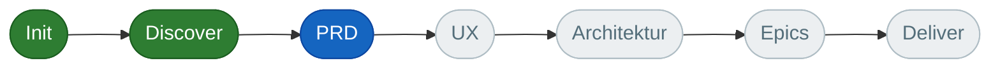
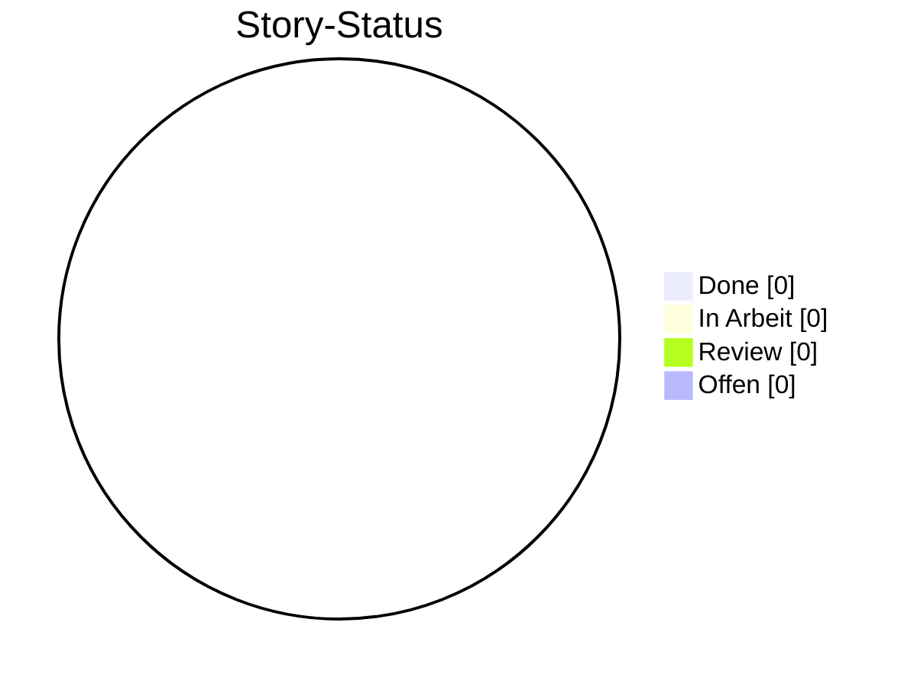
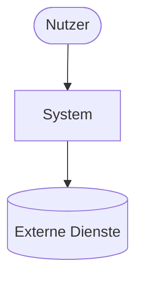
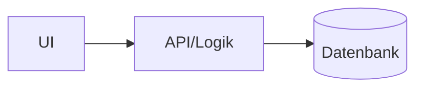
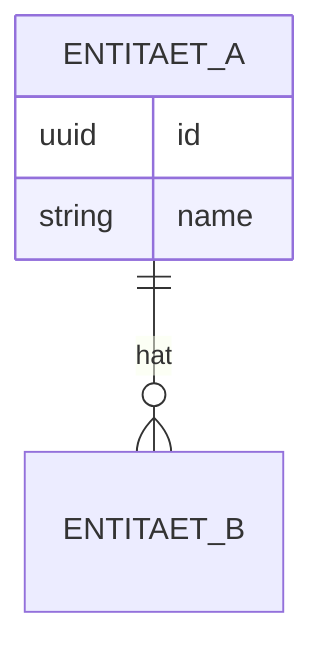
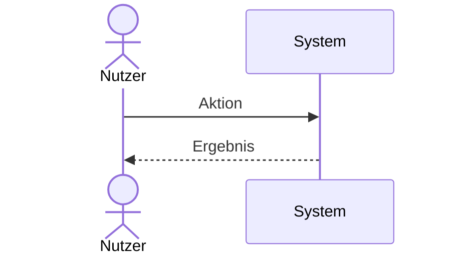

# ESC — Tracker & lebende Dokumentation

ESC führt **zwei mitlaufende Markdown-Dateien**, die nebenbei von jeder Phase aktualisiert
werden — als menschenlesbare Sicht auf den maschinellen Zustand (`esc/state.yaml`):

- `esc/TRACKER.md` — **Projekt-Tracker** (Fortschritt, Status, Decision-Log) — wird **regeneriert**.
- `esc/DOCUMENTATION.md` — **lebende Dokumentation** (Architektur, Datenmodell, Flows) — wächst inkrementell.

Beide nutzen Mermaid-Diagramme, damit sie in GitHub/IDE direkt gerendert werden.

## Die mitlaufen-Regel (für alle Phasen-Skills)
Am Ende jeder Phase, als Teil der Definition of Done, **immer**:
1. `esc/state.yaml` aktualisieren (autoritativ).
2. `esc/TRACKER.md` aus `state.yaml` neu erzeugen (siehe Vorlage unten). Wenn das Skript
   `${CLAUDE_PLUGIN_ROOT}/scripts/render_tracker.py` läuft, darf es genutzt werden; sonst manuell rendern.
3. `esc/DOCUMENTATION.md` um die Abschnitte ergänzen, die diese Phase liefert (Tabelle unten).
Existieren die Dateien noch nicht (erste Phase), aus den Vorlagen neu anlegen.

## Welche Phase füllt welchen Doku-Abschnitt
| Abschnitt in DOCUMENTATION.md | Diagrammtyp | Befüllt/aktualisiert durch |
|---|---|---|
| Überblick & Vision | — | discover, prd |
| Systemkontext | `flowchart TB` (Akteure↔System↔Externe) | discover/architecture |
| Architektur & Komponenten | `flowchart` | architecture |
| Datenmodell | `erDiagram` | architecture |
| Kern-Flows | `sequenceDiagram` / `flowchart` | ux, prd, architecture |
| Glossar | Tabelle | alle (Begriffe sammeln) |
| Verweise | Liste | epics/story (auf PRD, ADRs, Stories) |

---

## Vorlage: `esc/TRACKER.md`

````markdown
# 📊 ESC Tracker — <Projektname>
_Aktualisiert: <YYYY-MM-DD> · Level <0–4> · Aktuelle Phase: <phase>_

## Pipeline-Fortschritt

> Knoten je nach `artifacts`-Status stylen: done / active (aktuelle Phase) / pending / skipped (n/a).
> Für das Level nicht vorgesehene Phasen als `:::skipped` markieren.

## Artefakte
| Artefakt | Status |
|---|---|
| Constitution | ✓ done |
| Product Brief | ○ pending |
| PRD | … |
| UX-Spec | – n/a |
| Architektur | … |
| Epics & Stories | … |

## Gates (kritische Pflicht-Vertiefung)
| Gate | Erledigt |
|---|---|
| PRD: Erfolgsmetriken | ✗ |
| PRD: Requirements (Edge-Cases) | ✗ |
| Architektur: ADRs | ✗ |
| Stories: Akzeptanzkriterien | ✗ |

## Stories

| ID | Titel | Status |
|---|---|---|
| 1.1 | … | todo |

## Decision-Log
| ID | Thema | Entscheidung | Begründung |
|---|---|---|---|
| D-001 | … | … | … |

## Risiken & offene Fragen
- [ ] …
````

---

## Vorlage: `esc/DOCUMENTATION.md`

````markdown
# 📚 <Projektname> — Dokumentation
_Lebendes Dokument, automatisch durch ESC-Phasen gepflegt. Stand: <YYYY-MM-DD>._

## Überblick & Vision
<1–2 Absätze: Problem, Zielgruppe, Kernnutzen — aus Brief/PRD.>

## Systemkontext


## Architektur & Komponenten

<Kurzbeschreibung der Komponenten + Verweis auf relevante ADRs.>

## Datenmodell


## Kern-Flows


## Glossar
| Begriff | Bedeutung |
|---|---|

## Verweise
- PRD: `esc/prd.md`
- ADRs: `esc/decisions/`
- Stories: `esc/stories/`
````

## Mermaid-Hinweise
- Knoten-/Entitätsnamen ohne Sonderzeichen/Umlaute im Bezeichner (Label in `["…"]` darf Umlaute haben).
- Diagramme klein und lesbar halten; bei großen Modellen lieber mehrere fokussierte Diagramme.
- Bei jeder Aktualisierung das **ganze** betroffene Diagramm neu schreiben (kein Patchen einzelner Zeilen).
